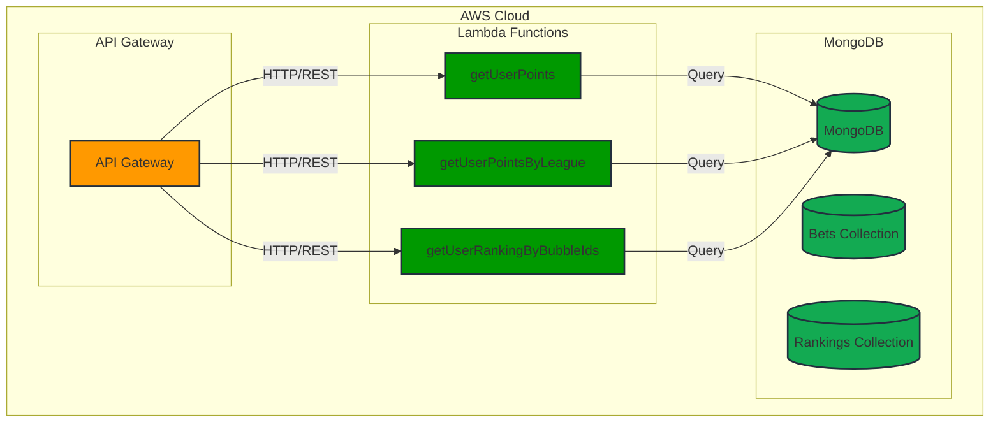
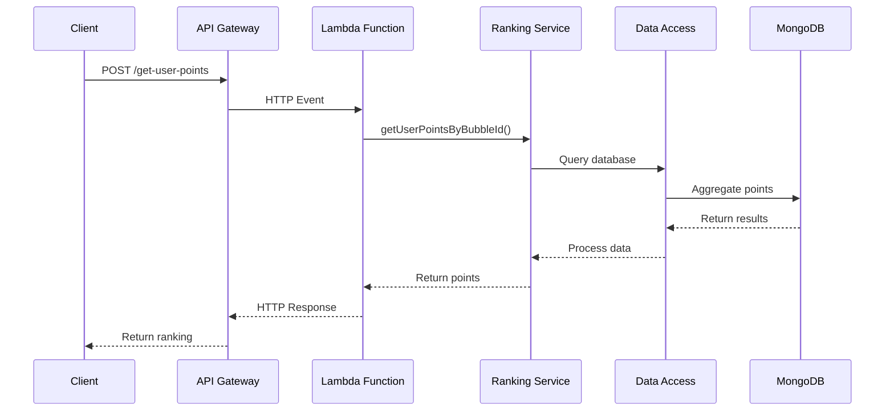

# System Architecture

## Overview

The League Process Get Ranking is a serverless service responsible for retrieving and calculating user rankings and points across multiple leagues. It follows a serverless architecture using AWS Lambda as the main function, with well-defined layers to ensure separation of responsibilities and maintainability.

## Architecture Diagram

## Sequence Diagram

## System Layers

### 1. API Layer (handler.js)
- Receives HTTP requests
- Validates input parameters
- Routes to appropriate services
- Handles error responses

### 2. Domain Layer (domain/)
- Implements business logic
- Calculates user points
- Manages ranking logic
- Processes multiple leagues

### 3. Infrastructure Layer (infrastructure/)
- Database connection management
- External service configurations
- Dependency management

### 4. Utils Layer (utils/)
- Utility functions
- Logging and monitoring
- Processing helpers

## Data Flow
1. HTTP request received by API Gateway
2. Lambda function processes request
3. Service layer coordinates business logic
4. Data Access layer queries MongoDB
5. Response is formatted and returned

## Security Considerations
- Input parameter validation
- Error handling and logging
- Processing state tracking
- Configurable timeouts (600s for getUserRankingByBubbleIds)

## Scalability
- Serverless architecture enables automatic scaling
- Asynchronous ranking processing
- Optimized database queries
- Performance monitoring through logging